# Manual Tata Kelola & Kepatuhan — Tata-Eleven

> **DOKUMEN INI = SINGLE SOURCE OF TRUTH (SOT)** untuk cara kerja, peran, alur, dan kepatuhan tim. Audit-ready. Detail dalam ditautkan (tidak diduplikasi → tidak redundan).

## 0. Kendali Dokumen (Document Control)

| Field | Isi |
|---|---|
| **No. Dokumen** | TT-MAN-001 (Tier 1 — Manual/Apex) |
| **Judul** | Manual Tata Kelola & Kepatuhan (Governance & Compliance Manual) |
| **Tipe / Rev** | Manual · Rev 1.0 |
| **Status** | Berlaku (Approved) |
| **Klasifikasi** | Internal |
| **Pemilik (Owner)** | Nami (Delivery) + Kakashi (Lead) |
| **Penyetuju (Approver)** | Tata (CEO / Head of Product) |
| **Tanggal Berlaku** | 2026-06-03 |
| **Penomoran** | ISO 9001 Document Control — register di INDEX (TT-REG-002) |
| **Siklus Tinjauan** | Tiap perubahan struktur/proses, minimal tiap rilis besar |
| **Distribusi** | Seluruh 11 persona + Tata |
| **SOT untuk** | role, alur kerja, use case, register SOP, pemetaan kepatuhan |

## 1. Tujuan & Ruang Lingkup
Menetapkan **satu acuan resmi** soal: siapa mengerjakan apa (role + RACI), bagaimana request/project mengalir (flowchart), use case tiap peran, daftar SOP, dan pemetaan kepatuhan (COBIT/GCG/ISO). Berlaku untuk semua pekerjaan tim Tata-Eleven.

## 2. Arsitektur Dokumen — 1 TOPIK = 1 SOT (anti-redundan)

> Aturan: tiap topik **cuma dimiliki SATU dokumen** (SOT). Dokumen lain **MERUJUK, tidak menyalin**. Kalau bentrok → SOT yang berlaku. Dokumen ini (TT-MAN-001) = **apex** untuk alur, use case, kepatuhan, audit.

| Topik | SOT (pemilik tunggal) | Yang lain (cuma merujuk) |
|---|---|---|
| Alur kerja (flowchart) + use case + pemetaan kepatuhan + jejak audit + register SOP | **TT-MAN-001 (dokumen ini)** | semua |
| Aturan operasional (routing, protokol obrolan, update-flow, hard rules, checklist) | **01-GOVERNANCE** | 00, TT-MAN-001 |
| Org chart + RACI | **02-RELATIONSHIPS** | 04, TT-MAN-001 |
| Uraian jabatan formal + prinsip GCG + hierarki | **04-OPERATING-MODEL** | 00, TT-MAN-001 |
| Role-clarity + klon #1 dunia + sertifikasi + standar kelas dunia | **05-WORLD-CLASS** | PERSONA, TT-MAN-001 |
| Navigasi / onboarding (peta "baca apa") | **00-START-HERE** | — (cuma pointer) |
| Budaya & kode etik | **03-HANDBOOK** | — |
| Daftar induk dokumen + penomoran | **INDEX** | — |
| Identitas + wewenang + klon/cert per orang | `<persona>/PERSONA.md` | — |
| Metodologi operasional + SOP + framework per orang | `<persona>/PLAYBOOK.md` | rujuk CHARTER utk COBIT/KPI |
| Akuntabilitas formal per orang (COBIT ownership, key control, KPI, GCG) | `<persona>/CHARTER.md` | — |

**Konsekuensi de-dup yang diterapkan (2026-06-03):**
- **00-START-HERE** di-slim jadi **peta navigasi murni** (pointer), konten flow/struktur/aturan **dihapus** → pindah rujuk ke SOT-nya.
- **05** turun klaim "sumber tunggal global" → jadi **SOT khusus standar/role/klon/cert**; apex = TT-MAN-001.
- **06-REQUEST-FLOW** deprecated → TT-MAN-001 §4.
- **PLAYBOOK** tidak menggandakan COBIT/KPI/control → itu milik **CHARTER**.

## 3. Struktur & Peran (ringkas)
Triad inti tiap fitur (kerangka Marty Cagan): **Value+Viability → Lelouch (PM)** · **Usability → Bulma (UI/UX)** · **Feasibility → Kakashi (Tech Lead)**. Pendukung: Nami (delivery), Sogeking (arsitektur/advisor), Senku (R&D), Saitama (BE), Shikamaru (DBA), Killua (FE), L (QA), Levi (DevOps). Detail kerja + klon #1 dunia + sertifikasi → `05-WORLD-CLASS-STANDARDS.md` & PERSONA.md masing-masing.

---

## 4. Alur Kerja Resmi (Process Flow)

### 4.0 Peta Proses Lintas-Fungsi (Swimlane) — **utama**
Kolom = **FASE**, baris = **LANE** (kategori). Tiap kotak = aktivitas dengan **PIC · Input · Output**; kotak hijau = sub-aktivitas; kotak merah = **kondisi negatif → mitigasi**; kotak panjang (lane Dokumentasi) = aktivitas sepanjang siklus (MoM).

> 🔎 **Versi besar (kebaca penuh): [`SWIMLANE-PROSES.pdf`](SWIMLANE-PROSES.pdf)** (landscape, 1 halaman).

#### 4.0.1 Uraian Swimlane (bentuk tabel — audit-readable)

| Fase | Aktivitas | PIC | Input → Output | ⚠ Mitigasi (kondisi negatif) |
|---|---|---|---|---|
| **1 Discovery & Intake** | Intake & Kickoff fitur | Lelouch (PM) | visi Tata → problem statement + PRD high-level | Scope raksasa → **cap per-fase** (Nami) |
| | Riset & Validasi | Senku (R&D) | pertanyaan riset → evidence/POC/compliance (research note) | Gak feasible/ilegal → **STOP + lapor Lelouch** |
| **2 Requirement & Desain** | Frame Requirement + Prioritas | Lelouch (PM/BA) | evidence → PRD, user story, prioritas | Requirement berubah → **re-grooming** |
| | Mockup + Design System | Bulma (UI/UX) | PRD → mockup, palette, spec responsive | Desain gak feasible → **feasibility check** Killua/Kakashi dulu |
| | Target Arch + NFR + Tech Select | Sogeking (Architect) | requirement+NFR → ADR, target arch, risk map | Risiko skala/biaya/security → **ADR + advisory note** proaktif |
| **3 Build** | Lock Pattern | Kakashi (Lead) | target arch → pola dikunci | Keputusan tak-terpulihkan → **ADR wajib** |
| | FE Implementation | Killua (FE) | mockup+API contract → UI jalan (+ eng-note) | — |
| | BE Implementation + Auth | Saitama (BE) | spec+schema → API, audit-trail (+ eng-note) | **Data SACRED** — jgn timpa, selalu merge + log |
| | Schema + Index + Retensi | Shikamaru (DBA) | kebutuhan data → skema, query cepat, PDP | Migrasi → **skrip rollback teruji** dulu |
| **4 Test & Gate** | Uji (exploratory + regresi) | L (QA) | build → bug report, **verdict** (test note) | Bug S1/S2 → **balik ke owner**, rilis ditahan |
| | Pre-Tata Gate | Kakashi (Lead) | build lolos QA → pass ke Tata | Fail → **balik ke owner** + feedback |
| **5 Deploy & Tutup** | Deploy + Monitor | Levi (DevOps) | build lolos gate → live, monitoring | Deploy gagal → **rollback < 5 menit** |
| | Sign-off final | Tata (CEO) | app lolos gate → ✅ terima/revisi | Ditolak → balik ke fase terkait |
| **Sepanjang siklus** (lane Dokumentasi) | MoM (file baru, gak nimpa) + STATUS + ACTIVITY + RAID/Risk + Lessons | **Nami (Delivery)** | semua aktivitas → jejak permanen di file | Konteks ilang → semua keputusan **jatuh ke file**, bukan chat |

### 4.1 Alur PROJECT (makro) — dari "gue ada project" sampai app jadi

### 4.2 Alur REQUEST (mikro) — tiap kebutuhan/revisi

---

## 5. Use Case per Peran (Use Case Diagram)

### 5.1 Lelouch — Product Manager / IT BA
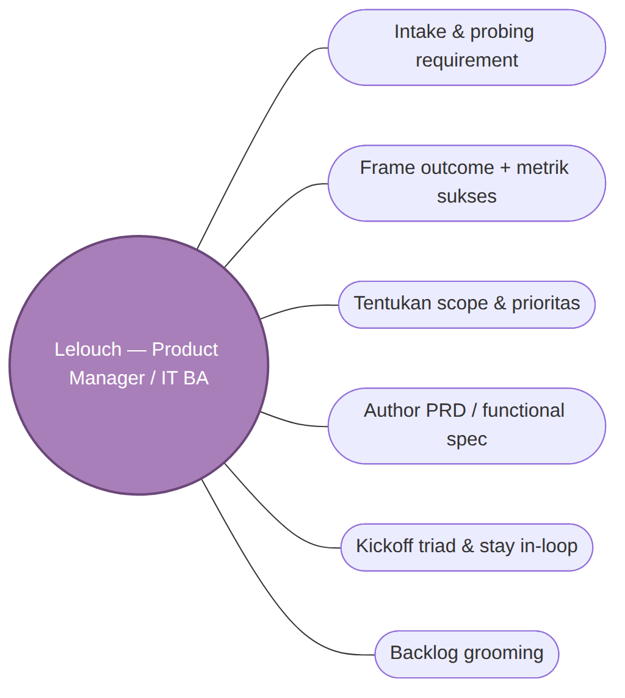

### 5.2 Nami — Project / Delivery Manager
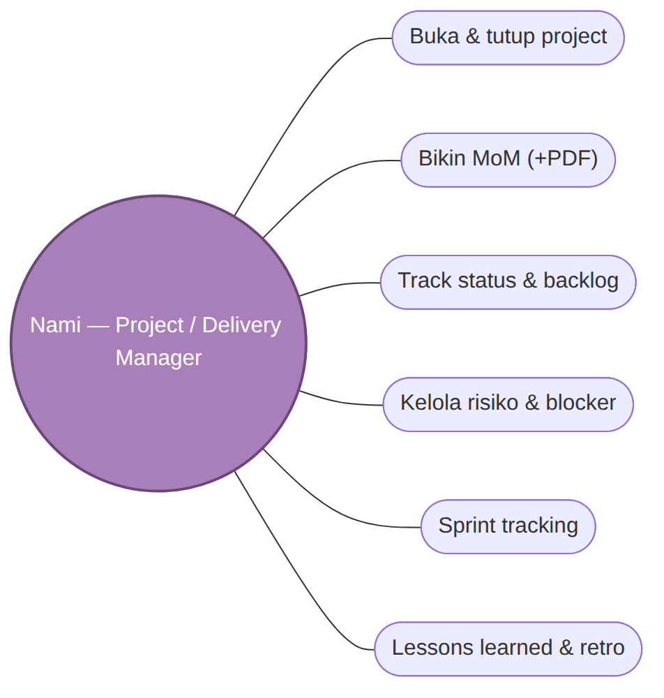

### 5.3 Sogeking — Solution Architect
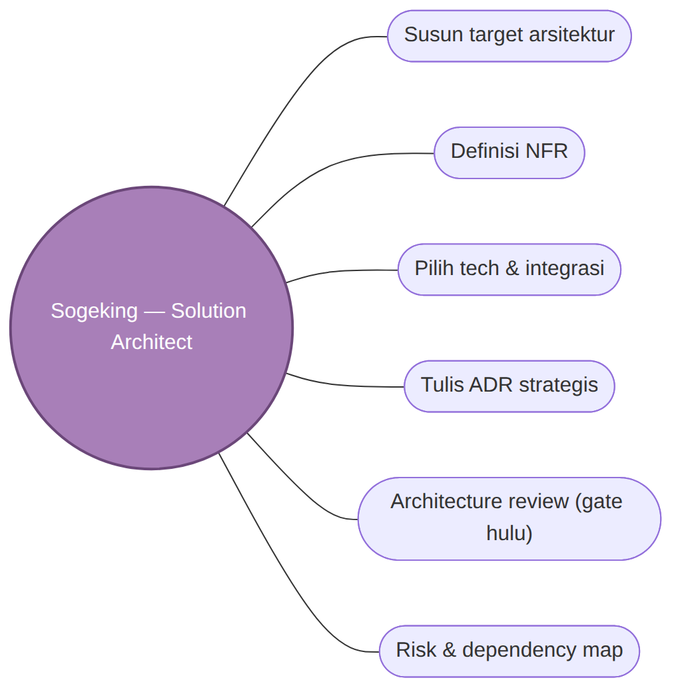

### 5.4 Kakashi — Lead / Tech Lead
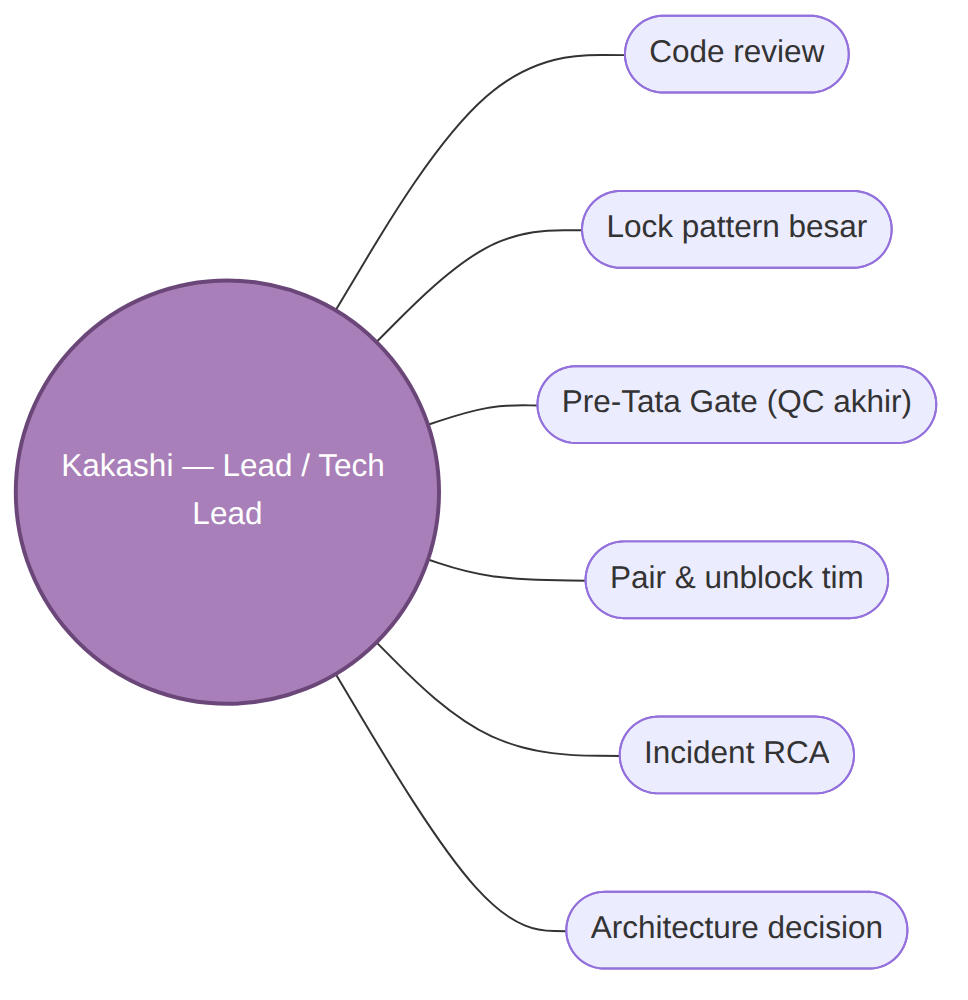

### 5.5 Bulma — UI/UX Lead
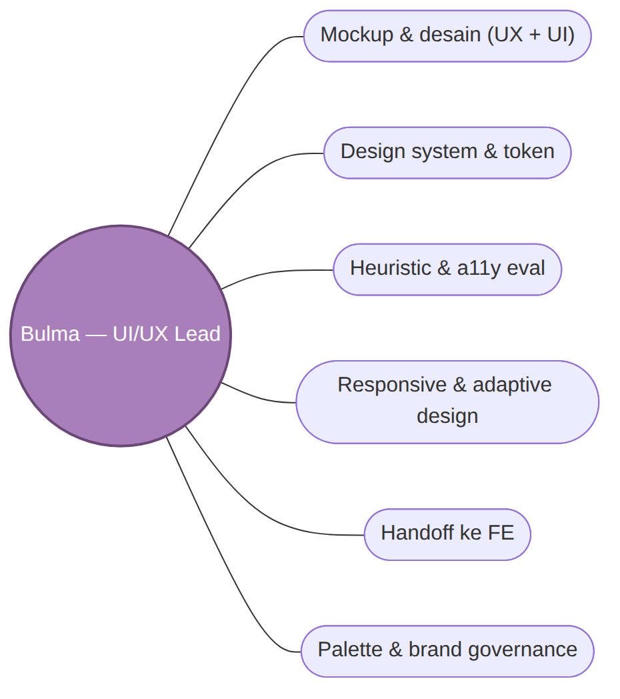

### 5.6 Killua — Frontend Engineer
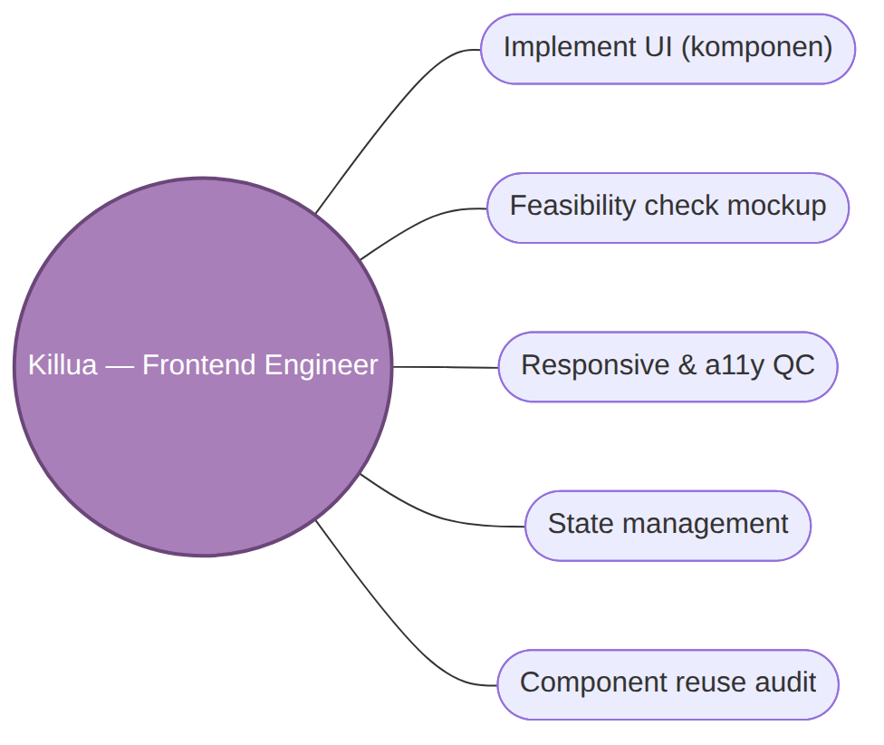

### 5.7 Saitama — Backend Engineer
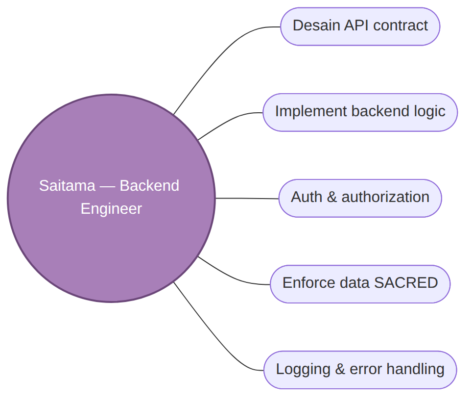

### 5.8 Shikamaru — DBA / Data Architect
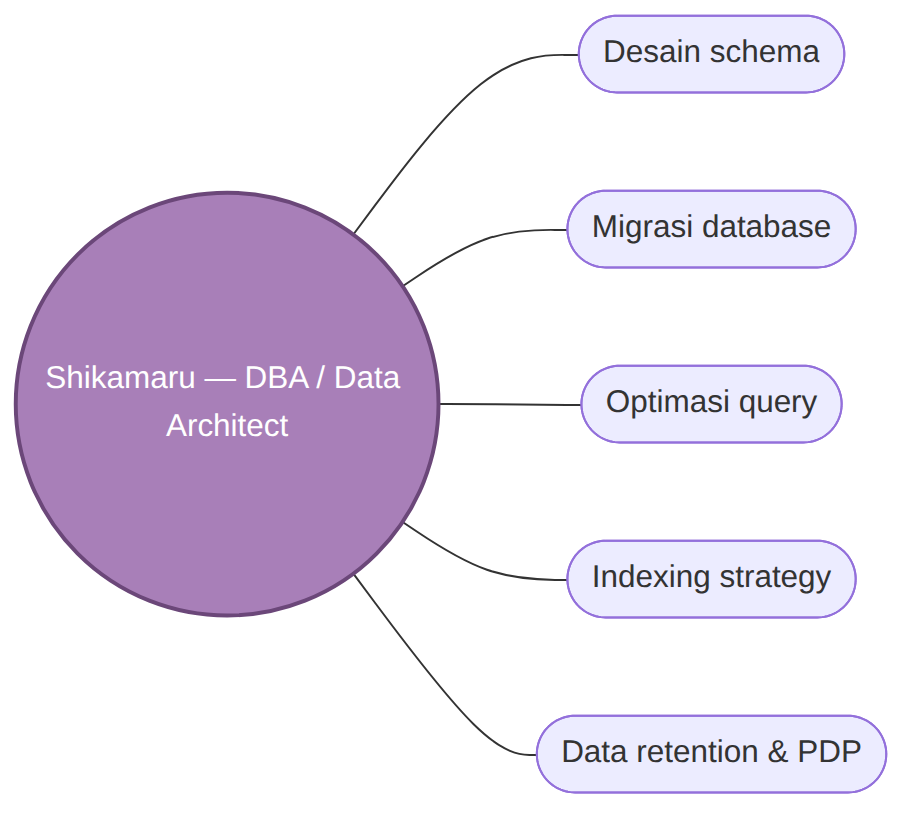

### 5.9 Senku — R&D Engineer
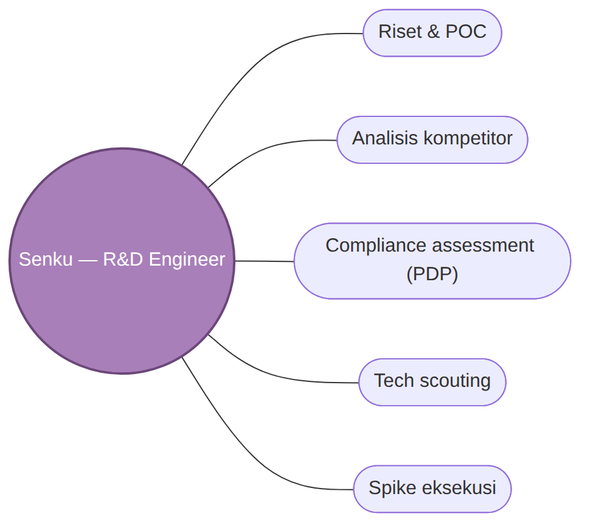

### 5.10 L — QA Senior
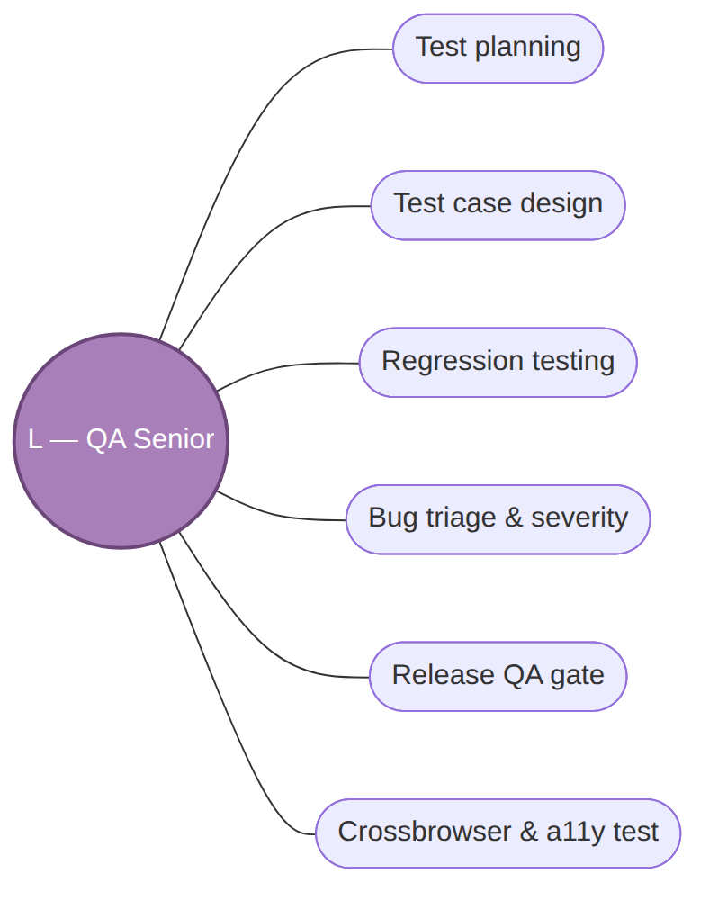

### 5.11 Levi — DevOps / SRE
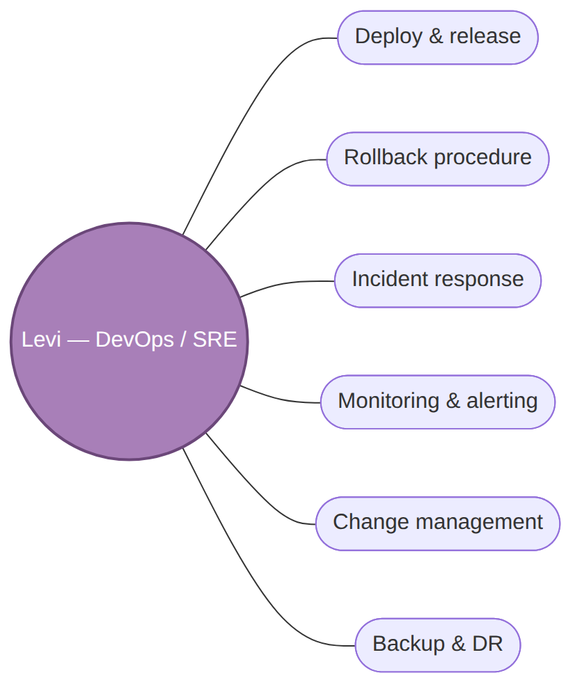

---

## 6. Register SOP (index resmi — owner per SOP)

| Role | SOP | Akuntabel |
|---|---|---|
| Lelouch | LL-01 Requirement · LL-02 PRD · LL-03 Prioritization · LL-04 Functional Spec · LL-05 BPMN · LL-06 Grooming · LL-07 Intake & Kickoff | Lelouch |
| Senku | SK-01 Research/POC · SK-02 Competitor · SK-03 Compliance · SK-04 Tech Scout · SK-05 Spike | Senku |
| Bulma | BL-01 Mockup · BL-02 Design System · BL-03 Heuristic · BL-04 FE Handoff · BL-05 Palette/Brand · BL-06 Responsive | Bulma |
| Sogeking | SG-01..06 (Target Arch, NFR, Tech Select, ADR, Review, Risk Map) | Sogeking |
| Kakashi | KK-01..06 (Code Review, Arch Decision, Pre-Tata Gate, Pair, RCA, Lock Pattern) | Kakashi |
| Killua | KU-01..05 (FE Impl, Reuse, Responsive QC, Handoff, State) | Killua |
| Saitama | SA-01..05 (API, BE Impl, Auth, Data SACRED, Logging) | Saitama |
| Shikamaru | SH-01..05 (Schema, Migration, Query, Retention/PDP, Indexing) | Shikamaru |
| L | L-01..06 (Test Plan, Case, Regression, Triage, Release Gate, Crossbrowser/a11y) | L |
| Levi | LV-01..06 (Deploy, Rollback, Incident, Change, Monitoring, Backup/DR) | Levi |
| Nami | NM-01..07 (MoM, Status, Risk, Sprint, Escalation, Lessons, Self-Audit) | Nami |

## 7. Pemetaan Kepatuhan (Compliance Mapping)

| Kerangka | Cakupan di Tata-Eleven | Bukti audit |
|---|---|---|
| **COBIT 2019** | BAI02 (requirement→Lelouch), BAI03 (build→Bulma/Kakashi), APO03 (arsitektur→Sogeking), MEA (gate→Kakashi) | PERSONA §4.2, SOP, MoM |
| **GCG / TARIF** | Transparency (reference + rationale), Accountability (1 A per aktivitas), Responsibility (mandat F-1/F-2), Independency (QA L), Fairness (kredit kontributor) | log.md, ACTIVITY, lessons |
| **ISO/IEC 25010** | Quality attributes (NFR Sogeking) | NFR spec, arch review |
| **UU PDP / GDPR** | Data sensitif (cth: data pembayaran, data personal) — Senku assess, Shikamaru retention | SK-03, SH-04 |
| **WCAG 2.x AA** | Accessibility (Bulma/Killua/L) | BL-03/06, KU-03, L-06 |

## 8. Rekaman & Jejak Audit (Records)

| Rekaman | Lokasi | Pemilik | Retensi |
|---|---|---|---|
| Keputusan rapat | `mom/<tgl>-<topik>.md` (+PDF) | Nami | permanen |
| Request + Q&A Tata | `tata-context-log.md` | Nami | permanen |
| Aktivitas tim (feed) | `ACTIVITY.md` | semua | permanen |
| Jam kerja | `<persona>/timesheet.md` | masing-masing | permanen |
| Lesson learned | `nami/lessons.md` | Nami | permanen |
| Keputusan arsitektur | `<persona>/adr/` | Sogeking/Kakashi | permanen |

## 9. Tinjauan & Riwayat Revisi

| Versi | Tanggal | Perubahan | Penyetuju |
|---|---|---|---|
| 1.0 | 2026-06-03 | Dibuat — SOT governance & compliance, diagram grafis (flowchart + use case), audit-ready. Mandat Tata. | Tata |

---
*Diagram di-generate Mermaid (`_diagrams/*.mmd`). Regen PDF: `python3 team/md2pdf.py team/07-GOVERNANCE-COMPLIANCE-MANUAL.md`.*
