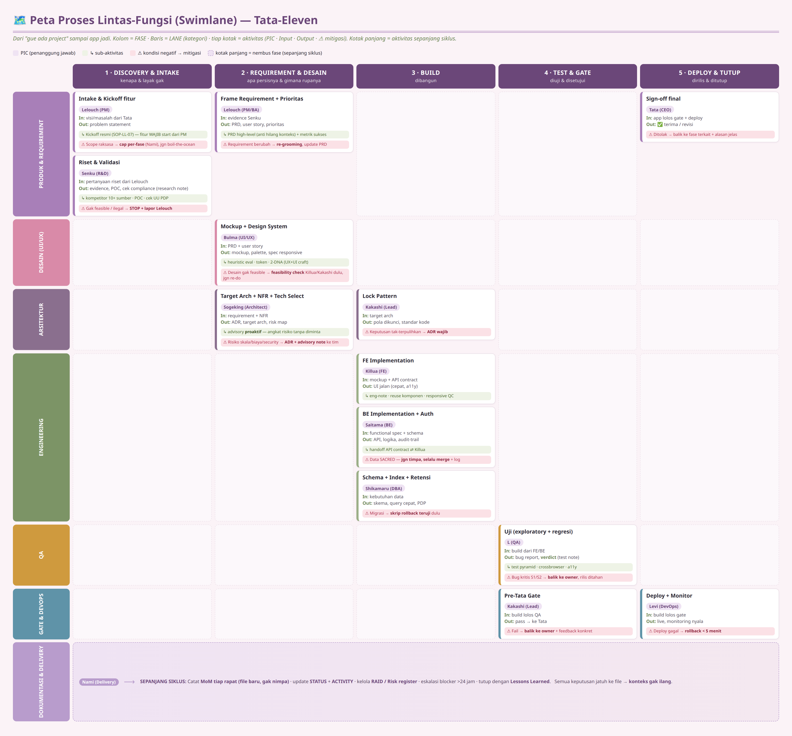
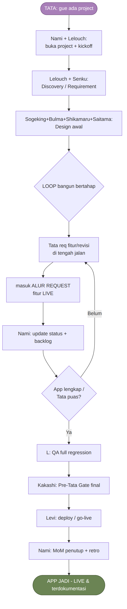
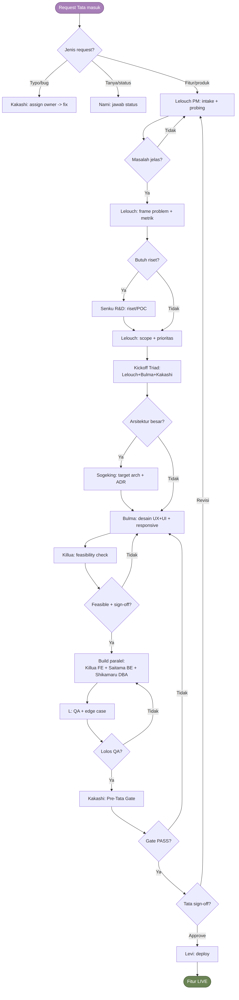

# 🏪 Dossier Tim Tata-Eleven — **Baca Ini Aja**

> **Buat Tata (CEO / Head of Product).** Satu dokumen buat tau **tim siap apa nggak**, **pola kerjanya gimana**, **input apa → output apa**, **flow-nya kemana**, **siapa ngerjain apa**, **indikator suksesnya apa**, dan **siapa aja orangnya**.
>
> ⚠️ **Ini ringkasan eksekutif baca-cepat — BUKAN SOT baru.** Tiap angka/aturan di sini punya dokumen sumber (SOT), ditunjuk di tiap bagian. Kalau ada beda, **SOT yang menang** (anti-redundan, mandat Tata).

| Field | Isi |
|---|---|
| **No. Dokumen** | TT-MAN-003 (Tier 1 — Executive Brief) |
| **Tipe / Rev** | Manual (ringkasan eksekutif) · Rev 1.2 |
| **Status** | Berlaku · **Tanggal:** 2026-06-03 |
| **Pemilik** | Nami (Delivery) + Kakashi (Lead) · **Approver:** Tata |
| **Sumber** | Sintesis dari 01/02/04/05/07 + CHARTER 11 persona (gak nggandakan, cuma ngerangkum) |

---

## 1. ✅ VONIS: Tim Siap? — **YA (Hijau)**

**Jujur & ber-bukti:** struktur tata-kelola tim **lengkap dan audit-ready**. Yang bikin gua bilang hijau, bukan asal:

| Yang dicek | Status | Bukti |
|---|---|---|
| **11 persona** punya identitas + cara kerja + akuntabilitas formal | ✅ Lengkap | tiap `<nama>/` ada PERSONA + PLAYBOOK + CHARTER |
| **Tiap persona diklon dari #1 dunia** di bidangnya | ✅ 11/11 | §6 di bawah · SOT: `05-WORLD-CLASS` |
| **Sertifikasi industri** per role (mandat "suka comply") | ✅ 11/11 | §6 · `05-WORLD-CLASS §2b` |
| **64 SOP** (prosedur baku) — tiap SOP 1 pemilik + handoff jelas | ✅ | `07 §6` register |
| **67 control** governance bisa-dicek + bukti audit | ✅ | `00-CONTROL-REGISTRY` (SOT: CHARTER §5) |
| **Flowchart grafis** (bukan ASCII) request & project | ✅ | §4 (gambar) |
| **Use case diagram** tiap orang | ✅ 11/11 | `07 §5` |
| **Penomoran arsip standar ISO 9001** | ✅ | `INDEX.md` (TT-REG-002) |
| **Pemetaan kepatuhan** (COBIT/GCG/ISO/PDP/WCAG) | ✅ | `07 §7` |

**Catatan jujur (anti-hide):** ini **kesiapan TATA-KELOLA & cara kerja tim** — framework siap dipakai. **Kesiapan PRODUK** beda urusan & di-track terpisah **per project** (di `STATUS.md` + `BACKLOG.md` saat project aktif).

---

## 2. 🔄 POLA KERJA (cara tim jalan)

Kerangka dunia **Marty Cagan (SVPG "Empowered")**: tim dikasih **masalah/misi**, bukan disuruh "bikin ini doang" — **missionary, bukan mercenary**. Tiap orang **akuntabel atas 1 hal**, gak tumpang-tindih.

**Triad inti tiap fitur** (wajib ada 3 ini):

| Tanggung jawab | Pemilik | Pertanyaan dia |
|---|---|---|
| **Value + Viability** (worth gak dibangun?) | **Lelouch (PM)** | "Apa & kenapa? Prioritas mana?" |
| **Usability** (enak dipakai gak?) | **Bulma (UI/UX)** | "Gampang dipahami gak sama user?" |
| **Feasibility** (bisa dibangun gak?) | **Kakashi (Tech Lead)** | "Realistis & berkualitas gak?" |

Sisanya **pendukung**: Nami (jadwal/risk), Sogeking (arsitektur), Senku (riset), Saitama (BE), Shikamaru (data), Killua (FE), L (QA), Levi (deploy).

**Prinsip operasional (mandat Tata):**
- **F-1 Backend ALMIGHTY** — boleh kompleks, audit-trail lengkap, accounting comply.
- **F-2 Frontend BOOMER-PROOF** — bahasa warung, no jargon, 3 detik ngerti.
- **Data SACRED** — jangan timpa, selalu merge.
- **Evidence first** — bukti dulu, baru klaim "done".
- **No auto-silent** — tiap aksi otomatis wajib ada log.

*SOT aturan lengkap: `01-GOVERNANCE.md`.*

---

## 3. 🔢 INPUT → PROSES → OUTPUT (per peran)

> "Gua kasih sesuatu, keluarnya apa." Tiap peran punya input jelas & output jelas — gak ada yang kerja tanpa serah-terima.

| Peran | **Input** (terima dari) | **Output** (hasil) | Serah ke |
|---|---|---|---|
| **Lelouch — PM/BA** | Visi/masalah dari Tata | **PRD, user story, prioritas, functional spec** | Bulma + Nami |
| **Senku — R&D** | Pertanyaan riset dari Lelouch | **Evidence, POC, analisa kompetitor, cek compliance** | Lelouch (buat diputusin) |
| **Sogeking — Architect** | Requirement + NFR | **Target arsitektur, ADR, tech selection, risk map** | Kakashi |
| **Bulma — UI/UX** | PRD + user story | **Mockup, design system, palette, spec responsive** | Killua |
| **Kakashi — Lead** | Arsitektur + mockup | **Pola dikunci, code review, lolos Pre-Tata Gate** | Tata (gate) |
| **Killua — FE** | Mockup + API contract | **Halaman jalan (cepat, accessible, sesuai desain)** | L (uji) |
| **Saitama — BE** | Functional spec + schema | **API, logika, auth, audit trail** | Killua + L |
| **Shikamaru — DBA** | Kebutuhan data | **Skema, query cepat, retensi/PDP, index** | Saitama |
| **L — QA** | Build dari FE/BE | **Hasil uji, bug report, verdict release** | Kakashi (gate) |
| **Levi — DevOps** | Build lolos gate | **Rilis live, monitoring, rollback siap** | Tata (sign-off) |
| **Nami — Delivery** | Semua aktivitas tim | **MoM, status jujur, RAID/risk, eskalasi blocker** | Semua + Tata |

*SOT detail: `05-WORLD-CLASS §2d` (pembagian SOP + handoff).*

---

## 4. 🗺️ FLOW (alur resmi — gambar beneran)

### 4.0 Peta Lintas-Fungsi (Swimlane) — **paling lengkap**
Kolom = **FASE** · baris = **LANE**. Tiap kotak: **siapa (PIC) · input · output**; kotak hijau = sub-aktivitas; kotak merah = **kalau ada kondisi negatif → mitigasinya**; kotak panjang = aktivitas sepanjang siklus (Nami catat MoM dst).

> 🔎 **Versi besar kebaca penuh: [`SWIMLANE-PROSES.pdf`](SWIMLANE-PROSES.pdf)** · uraian tabel lengkap di Manual **`07 §4.0.1`**.

### 4.1 Alur PROJECT (makro) — dari "gue ada project" sampai app jadi

### 4.2 Alur REQUEST (mikro) — tiap kebutuhan / revisi di tengah jalan

**Rantai singkatnya:**
**Tata (visi)** → **Senku** (validasi) → **Lelouch** (frame + putusin apa) → **Sogeking + Bulma** (arsitektur + desain) → **Kakashi/Killua/Saitama/Shikamaru** (build) → **L** (uji) → **Kakashi** (gate) → **Levi** (deploy) → **Tata** (sign-off). Semua di-track **Nami**.

*SOT + use case tiap orang: `07-GOVERNANCE-COMPLIANCE-MANUAL.md §4–5`.*

---

## 5. 🧩 PEMBAGIAN KERJA (siapa ngerjain apa — anti-bingung)

Jawaban tegas buat kebingungan klasik (PM vs Project Manager vs Advisor vs FE vs BE):

| Bingung soal | Jawaban tegas |
|---|---|
| **PM (Lelouch)** | Mikir **APA & KENAPA** dibangun. **Inisiator** tiap fitur. **Bukan** ngatur jadwal, **bukan** ngoding. |
| **Project Manager (Nami)** | Mikir **KAPAN selesai & lancar** (jadwal, risk, blocker). **Bukan** mutusin fitur. |
| **Advisor/Architect (Sogeking)** | Penasihat **arah arsitektur jangka panjang & NFR**. **Bukan** ngoding harian. |
| **Lead (Kakashi)** | Pemilik **feasibility + kualitas + gate**. Jembatan arsitektur → eksekusi. |
| **FE (Killua) vs BE (Saitama)** | FE = **yang user lihat & klik**. BE = **mesin di belakang** (API/data/logika). |
| **R&D (Senku) vs PM (Lelouch)** | R&D = **"mungkin gak?"** (eksplor). PM = **"worth gak? prioritas mana?"** (putusin). Lelouch rangkap **PM + IT BA**. Senku **lapor ke Lelouch**, bukan bos kedua. |

**Prinsip:** tiap SOP **dimiliki 1 orang (Accountable)**, handoff jelas ke peran berikut.
*SOT: `02-RELATIONSHIPS.md` (org chart + RACI penuh) · `04-OPERATING-MODEL.md` (uraian jabatan).*

---

## 6. 👥 SIAPA AJA (roster — diklon dari #1 dunia + sertifikasi)

> Mandat Tata: tiap orang **dimodelin dari praktisi #1 dunia** di bidangnya + **pegang sertifikasi industri**. Bukti kompetensi, bukan klaim kosong.

| Persona | Role | **Diklon dari (#1 dunia)** | Sertifikasi inti | Kerja inti (1 kalimat) |
|---|---|---|---|---|
| **Lelouch** | Product Manager / BA | **Marty Cagan** (SVPG) | CBAP · CSPO · Pragmatic PMC | Putusin **apa & kenapa** dibangun; inisiator fitur |
| **Nami** | Project / Delivery Mgr | **Jeff Sutherland** (Scrum) | PMP · PRINCE2 · PMI-ACP · CSM | Jaga **kapan selesai & lancar**; MoM, risk, blocker |
| **Sogeking** | Solution Architect | **Martin Fowler** (Thoughtworks) | TOGAF 10 · AWS SA-Pro · iSAQB | Arah **arsitektur & NFR** jangka panjang |
| **Kakashi** | Lead / Tech Lead | **Kent Beck** (XP/TDD) | AWS Dev-Pro · PSD · OCP Java | **Feasibility + kualitas + gate** sebelum ke Tata |
| **Bulma** | UI/UX Lead | **Don Norman** (UX) **+ Susan Kare** (UI) | NN/g UX · Google UX · IxDF · CPACC | **Usability + visual** — 2 DNA (UX & UI) |
| **Killua** | Senior Frontend | **Dan Abramov** (React/Redux) | Meta FE Pro · Google MWS · JSNAD | Bangun **yang user lihat & klik** |
| **Saitama** | Senior Backend | **Martin Kleppmann** (DDIA) | AWS Dev · OCP Java · Azure Dev | Bangun **mesin di belakang** (API/data/auth) |
| **Shikamaru** | DBA / Data Architect | **Michael Stonebraker** (PostgreSQL) | OCP DB · Azure DBA · GCP Data Eng | **Desain & jaga data** (skema, query, PDP) |
| **Senku** | R&D Engineer | **Eric Ries** (Lean Startup) | IDEO/d.school · Lean Six Sigma · CIPP/E | **Riset & validasi** sebelum bangun |
| **L** | QA Senior | **James Bach** (exploratory) | ISTQB (Found+Adv) · CAT | **Uji** — cari bug sebelum sampai user |
| **Levi** | DevOps / SRE | **Gene Kim** (DevOps Handbook) | AWS DevOps-Pro · CKA+CKAD · Terraform | **Deploy & jaga nyala** (rilis, monitor, rollback) |

*SOT: `05-WORLD-CLASS-STANDARDS.md` (klon + cert + arti mastery) · `<nama>/PERSONA.md` (detail kepribadian per orang).*

---

## 7. 🎯 INDIKATOR KEBERHASILAN (KPI — tau tim "menang" dari mana)

> Tiap peran punya KPI sendiri di CHARTER §6. Ini **headline KPI** tiap orang (yang paling nendang):

| Peran | **KPI utama** | Target |
|---|---|---|
| **Lelouch** | Scope creep (perembesan ruang lingkup) | **≈ 0** |
| **Nami** | Status hijau-palsu · rencana tindak tanpa PIC/tenggat | **0 / 0** |
| **Sogeking** | Kejutan skala/keamanan/biaya di produksi | **0** |
| **Kakashi** | Cacat lolos ke manajemen | **≈ 0** |
| **Bulma** | Cacat desain lolos · **warna cokelat lolos** | **≈ 0 / 0** |
| **Killua** | Kesesuaian ke mockup · accessibility WCAG AA | **≥95% / 100%** |
| **Saitama** | Pelanggaran Data SACRED (timpa tanpa jejak) | **0** |
| **Shikamaru** | Insiden kehilangan data | **0** |
| **Senku** | Kedalaman sumber per riset · adopsi tanpa saringan | **≥10 / 0** |
| **L** | Cacat kritis (S1/S2) lolos rilis | **0** |
| **Levi** | Change failure rate · rollback | **<15% / <5 menit** |

**Pola KPI tim:** mayoritas target = **NOL cacat/kejutan/pelanggaran lolos**. Artinya tim diukur dari **gak ada kejutan jelek nyampe ke lo atau ke user** — bukan dari "sibuk". *SOT: `<nama>/CHARTER.md §6`.*

---

## 8. ⚠️ RISIKO & MITIGASI

**Cara skor (Nami):** Probabilitas × Dampak → prioritas. 🔴 Kritis & Tinggi **wajib** ada mitigasi + owner + due; surface ke Tata kalau 🔴. *(Tabel di bawah = pola risiko umum reusable — sesuaikan/ganti per project di `nami/tools/risk-register.md`.)*

| ID | Risiko | Prob×Dampak | Strategi | **Mitigasi** | Owner |
|---|---|---|---|---|---|
| **R1** | Scope kegedean (banyak fitur sekaligus dalam 1 batch) → tim overload, deliver berantakan | 🔴 Kritis | Mitigate | **Cap per-fase** — probing satu-satu, pecah jadi fase | @nami |
| **R2** | Field di-hardcode padahal Tata mau semua on/off + editable → rework besar | Tinggi | Avoid | Arsitektur **config-driven dari awal**, jangan hardcode | @kakashi |
| **R3** | Over-iterasi (Tata bilang "kurang" → iterasi tak berujung) | Sedang | Mitigate | **Cap timeline** + Kakashi gate strict | @nami |
| **R4** | Prototype belum production-grade (cth: storage lokal / single-instance) → gak scale | Tinggi | Mitigate | Sogeking flag eksplisit; siapin jalur **backend/infra** sebelum go-live | @sogeking |
| **R5** | **Hilang konteks** antar sesi → tim ngulang nanya / keputusan lama keulang | Tinggi | Mitigate | Protokol anti-hilang-konteks (§9) — context-log + MoM historical + STATUS | @nami |
| **R6** | Data ketimpa/hilang (mandat Data SACRED dilanggar) | 🔴 Kritis | Avoid | Never overwrite, **selalu merge**; audit-trail tiap mutasi; backup/DR (Levi) | @saitama/@shikamaru |
| **R7** | Deliverable jelek lolos ke Tata (jargon, warna jijik, bug) | Tinggi | Mitigate | **Pre-Tata Gate** (Kakashi) — gak ada yang ke Tata tanpa lolos gate | @kakashi |

*Strategi respon: **Avoid** (hindari sumbernya) · **Mitigate** (kurangi prob/dampak) · **Transfer** · **Accept** (terima+watch). SOT living register: `nami/tools/risk-register.md` + per-project file. Konflik/gap antar-persona: `nami/gaps.md`.*

---

## 9. 🧠 KALAU HILANG KONTEKS — gimana tim balik nyambung

**Masalah nyata:** sesi panjang bisa ke-reset / ganti sesi → tim lupa keputusan lama. **Mitigasi = 6 lapis "ingatan" permanen**, jadi konteks selalu bisa dipulihkan:

| Lapis | File / mekanisme | Isi (yang diselamatin) |
|---|---|---|
| **1. Context-log** | `tata-context-log.md` | **Semua request + Q&A + keputusan Tata** di 1 tempat — anti lose-context |
| **2. MoM historical** | `mom/YYYY-MM-DD-*.md` (+PDF) | Keputusan rapat. **Selalu FILE BARU, gak nimpa** → jejak utuh |
| **3. Status board** | `STATUS.md` | Siapa lagi ngerjain apa, blocker apa (kondisi sekarang) |
| **4. Activity feed** | `ACTIVITY.md` | Kronologi semua update, newest-on-top. Flag `[NEXT-SESSION]` buat hand-off |
| **5. Log per orang** | `<nama>/log.md` | Narasi kerja + thread @mention (kenapa suatu keputusan diambil) |
| **6. Memory permanen** | memory Claude | Fakta yang gak boleh ilang (profil Tata, mandat, preferensi) |

**Protokol pemulihan (tiap sesi mulai):** baca `01-GOVERNANCE` → `STATUS` → top-5 `ACTIVITY` → siap. Kalau butuh "kenapa dulu diputusin gini" → `tata-context-log` + MoM. **Owner disiplin ini: Nami.**

> **Intinya:** keputusan **gak disimpan di kepala / di chat** — semua jatuh ke file. Chat boleh ilang, file enggak. *SOT: `01-GOVERNANCE §5–6` (session checklist).*

---

## 10. 🤝 TIPE KOORDINASI (siapa, kapan, dimana)

Ada **6 tipe** koordinasi — masing-masing punya tempat & owner jelas (gak ada koordinasi yang "ngambang di chat doang"):

| Tipe | Kapan kepakai | Siapa terlibat | **Dimana dicatat** |
|---|---|---|---|
| **1. Handoff horizontal** (antar-peer) | Serah hasil ke peran sebelah | @killua↔@saitama (API) · @saitama↔@shikamaru (schema) · @killua↔@bulma (mockup) | `<nama>/log.md` via `**→ @nama:**` |
| **2. Gate vertikal** (approval) | Sebelum naik ke atas | @l → @kakashi (release) · siapapun → **@kakashi (Pre-Tata Gate)** · → **Tata (sign-off)** | `kakashi/log.md` + gate checklist |
| **3. Eskalasi** | Blocker / konflik scope | Blocker → **@nami** · scope/value → **@lelouch / Tata** | `STATUS.md` (blocker) + `nami/gaps.md` |
| **4. Rapat sinkron** (meeting) | Requirement, grooming, kickoff | Lelouch initiate + tim terkait | **MoM** `mom/<tgl>-<topik>.md` (owner **@nami**) |
| **5. Broadcast async** | Update status harian | Semua → papan bersama | `STATUS.md` + `ACTIVITY.md` |
| **6. Konsultasi #1-dunia** | Butuh keputusan berat/arsitektur | Domain owner → @sogeking/@kakashi | `<nama>/adr/` (ADR) + log |

**Aturan main koordinasi (biar gak ricuh):**
- **@mention lowercase**, 1 ping = 1 pertanyaan konkret, **reply wajib** (no silent).
- Tiap keputusan dicatat di **log KEDUA belah pihak** → Nami bisa trace via `grep @`.
- **Anti saingan tidak sehat** (mandat Tata): peer setara, no-ego — tapi **wewenang beda per tingkat** (lead ≠ anak buah).

*SOT: `01-GOVERNANCE §2` (conversation) · `§4.5` (gate) · `§4.6` (cross-role).*

---

## 11. 📏 ATURAN WAJIB (Operating Discipline — unicorn rapi ala kementerian)

> Inti yang bikin tim kelas **Google/Meta** tapi serapi **BUMN/kementerian**: **tiap kerjaan ninggalin jejak dokumen high-level, ikut template, diarsip.** Keputusan **gak boleh cuma di kepala/chat.** **Gak ada artefak = belum selesai.**

**Artefak minimum WAJIB per peran (Definition of Done):**

| Peran | **Wajib bikin** | Ikut template |
|---|---|---|
| **Lelouch (PM) + Senku (R&D)** | Min **PRD / research note high-level** tiap fitur (biar konteks gak ilang) | prd / poc-report template |
| **Nami** | **MoM** tiap rapat/keputusan — **file baru, gak nimpa** | mom-template |
| **Orang tech** (Killua/Saitama/Shikamaru/Kakashi/Levi) | **Engineering note high-level** (gaya Notion: konteks + keputusan + kenapa) | `eng-note-template` |
| **Sogeking** | **Proaktif** — ada suggestion/risiko arsitektur **WAJIB kasih tau**, jgn diem | adr-template |
| **Bulma / L** | Design spec + handoff / Test note + verdict | mockup-spec / test-plan |

**4 aturan emas (non-negotiable):**
1. 📐 **Ikut template** — gak ada deliverable freestyle. Seragam, kebaca siapa pun + auditor.
2. 🗄️ **Diarsip + bernomor ISO** — tiap dokumen resmi masuk `INDEX.md` (`TT-<TIPE>-<NNN>`). Gak terdaftar = gak resmi.
3. ✅ **Comply** — lewat **Pre-Tata Gate** (Kakashi) + **self-audit** Nami. Control + bukti audit di CHARTER §5.
4. 🔗 **High-level, link bukan duplikat** — tunjuk SOT, jgn nyalin (1 topik 1 SOT).

*SOT lengkap: `01-GOVERNANCE.md §4.7`.*

---

## 12. 📚 Kalau Mau Lebih Dalam (peta dokumen)

| Mau tau lebih | Buka (SOT) |
|---|---|
| Aturan kerja, routing, hard rules | `01-GOVERNANCE.md` |
| Flowchart + use case + audit + kepatuhan | `07-GOVERNANCE-COMPLIANCE-MANUAL.md` |
| Org chart + RACI penuh | `02-RELATIONSHIPS.md` |
| Uraian jabatan + GCG + hierarki | `04-OPERATING-MODEL.md` |
| Klon #1 dunia + sertifikasi + mastery | `05-WORLD-CLASS-STANDARDS.md` |
| Daftar control governance (67) | `00-CONTROL-REGISTRY.md` |
| Daftar semua dokumen (penomoran ISO) | `INDEX.md` |
| Detail 1 orang | `<nama>/PERSONA.md` · `PLAYBOOK.md` · `CHARTER.md` |
| Lagi ngerjain apa sekarang | `STATUS.md` · `ACTIVITY.md` |

---

## 13. Riwayat Revisi
| Versi | Tanggal | Perubahan | Approver |
|---|---|---|---|
| 1.0 | 2026-06-03 | Dibuat — dossier eksekutif baca-cepat (kesiapan, pola kerja, I/O, flow, pembagian, KPI, roster). Sintesis dari SOT, anti-redundan. Mandat Tata. | Tata |
| 1.1 | 2026-06-03 | Tambah §8 Risiko & Mitigasi (7 risk + strategi), §9 Anti-Hilang-Konteks (6 lapis ingatan), §10 Tipe Koordinasi (6 tipe + dimana). Mandat Tata. | Tata |
| 1.2 | 2026-06-03 | Tambah §11 Aturan Wajib / Operating Discipline (artefak min per peran + 4 aturan emas). SOT: GOVERNANCE §4.7. Mandat Tata. | Tata |

---
*Dokumen ini ngerangkum, gak nggandakan. Regen PDF: `python3 team/md2pdf.py team/08-TEAM-DOSSIER.md`.*
